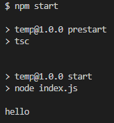
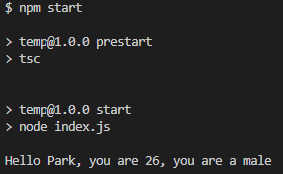
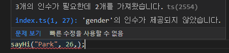
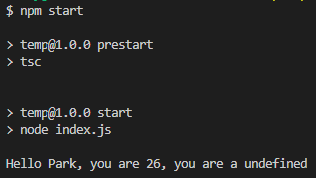
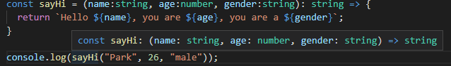
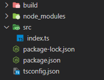
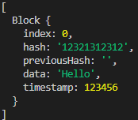
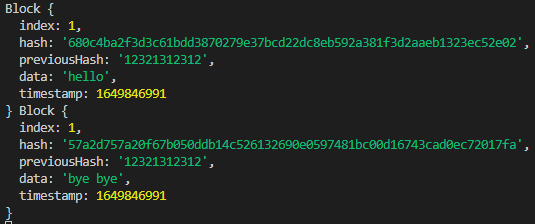
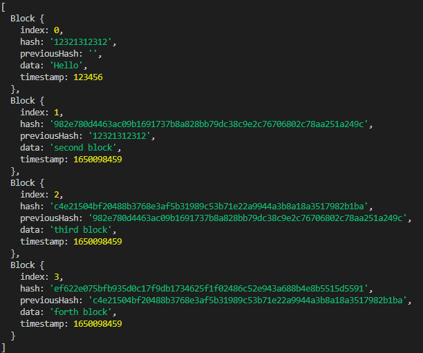

# Typechain

블록체인과 함께 배우는 typescript 실습

참조: [Typescript로 블록체인 만들기](https://nomadcoders.co/typescript-for-beginners/lobby)


## 목차

1. [Setting Typescript Up](#Setting-Typescript-Up)
1. [First steps with Typescript](#First-steps-with-Typescript)
1. [Types in Typescript](#Types-in-Typescript)
1. [Interfaces on Typescript](#Interfaces-on-Typescript)
1. [Classes on Typescript part One](#Classes-on-Typescript-part-One)
1. [Creating-a-Block-part-One](#Creating-a-Block-part-One)
1. [Creating a Block part Two](#Creating-a-Block-part-Two)
1. [Creating a Block part Three](#Creating-a-Block-part-Three)
1. [Validating Block Structure](#Validating-Block-Structure)
1. [Conclusions](#Conclusions)


## Setting Typescript Up

```bash
$ npm init
$ npm i typescript
```

위 명령어로 package.json을 만들고 typescript를 설치한다. 이 후 tsconfig.json을 만들고 다음과 같이 입력해 주자.

```json
// tsconfig.json

{
  "compilerOptions": {
    "module": "commonjs", // 일반적인 nodejs 사용
    "target": "ES2015", // javascript 컴파일 버전
    "sourceMap": true, // sroucemap 처리 여부
  },
  "include": ["index.ts"], // 컴파일 포함 파일
  "exclude": ["node_modules"] // 컴파일 제외
}
```

package.json에 script에 명령어를 추가해 주자.

```json
// package.json

{
	
    ...
    
  "scripts": {
    "start": "node index.js",
    "prestart": "tsc"
  },
	
    ...
    
}
```


이제 index.ts 파일을 생성하여 처음으로 시험해 보자.

```tsx
console.log("hello")
```

```bash
$ npm start
```



성공!


## First steps with Typescript

먼저 일반적인 Javascript 코드를 보자

```tsx
const sayHi = (name, age, gender) => {
  console.log(`Hello ${name}, you are ${age}, you are a ${gender}`);
}

sayHi("Park", 26, "male");
```

이를 실행해 보면



정상적으로 잘 수행이 된다. 그렇다면 `sayHi` 함수에 gender가 빠지면 어떻게 될까?



위 처럼 오류가 먼저 발생한다. 일반적인 Javascript의 경우는 오류가 발생하지 않고 일단 실행된다. 아마

```bas
Hello Park, you are 26, you are a undefined
```

와 같은 결과를 보여줄 것이다. Typescript는 코드를 실행하기 전 발생할 오류를 미리 알려주는 강력한 기능을 가지고 있다.

```tsx
const sayHi = (name, age, gender?) => {
  console.log(`Hello ${name}, you are ${age}, you are a ${gender}`);
}

sayHi("Park", 26);
```

이렇게 gender를 선택적 인자로 변경한다면 오류가 발생하지 않는다.




## Types in Typescript

이제 Typescript의 `Type`을 명시해 주자.

```tsx
const sayHi = (name:string, age:number, gender:string): string => {
  return `Hello ${name}, you are ${age}, you are a ${gender}`;
}

console.log(sayHi("Park", 26, "male"));
```



이렇게 설정해 주어 각각의 인자의 Type과 return의 Type을 설정해 주어 각각의 Type을 명확하게 해주자.


다음 단계로 넘어가기 전 `TSC watch`를 설치하여 빌드를 수행해 보자.

```bash
$ npm i tsc-watch --save-dev
```

그리고 src 폴더를 만들어 index.ts를 옮겨주고, build 폴더를 만들자.



이제 환경 설정을 변경해 주자.

```json
// package.json

{
	
    ...
    
  "scripts": {
    "start": "tsc-watch --onSuccess \" node build/index.js\" "
  },
    
	...
    
}
    
// tsconfig.json
    
{
  "compilerOptions": {
    "module": "commonjs",
    "target": "ES2015",
    "sourceMap": true,
    "outDir": "build"
  },
  "include": ["src/**/*"],
  "exclude": ["node_modules"]
}
```

이제 `npm start`를 수행하면 build파일이 생성되고 index.ts가 변경될 때마다 build파일 또한 변경된다.


### Interfaces on Typescript

`Interface`를 사용하여 함수에  객체를 전달해 보자.

```tsx
interface Human {
  name:string;
  age:number;
  gender:string;
}

const person = {
  name: "Park",
  age: 26,
  gender: "male"
};

const sayHi = (person: Human): string => {
  return `Hello ${person.name}, you are ${person.age}, you are a ${person.gender}!`;
};

console.log(sayHi(person));
```

이와 같이 `Interface`를 만들어서 내 `Object`가 함수에서 사용될 수 있도록 만들 수 있다.


## Classes on Typescript

Typescript의 클래스에 대해서 알아보자

```tsx
class Human {
  public name: string;
  public age: number;
  public gender: string;
  constructor(name:string, age:number, gender:string) {
    this.name = name;
    this.age = age;
    this.gender = gender;
  }
}

const lynn = new Human("Lynn", 18, "female")

const sayHi = (person: Human): string => {
  return `Hello ${person.name}, you are ${person.age}, you are a ${person.gender}!`;
};

console.log(sayHi(lynn));
```

일반적인 Javascript에서와 달리 `public` 선언으로 class의 속성을 선언해 준다. 만약 `private` 속성을 준다면 외부에서 사용하지 않게 보호할 수 있다.


### Creating a Block part One

이제 블록체인을 실제로 만들어 보자!!

```tsx
class Block {
  public index: number;
  public hash: string;
  public previousHash: string;
  public data: string;
  public timestamp: number;
  constructor(
    index: number,
    hash: string,
    previousHash: string,
    data: string,
    timestamp: number
  ) {
    this.index = index;
    this.hash = hash;
    this.previousHash = previousHash;
    this.data = data;
    this.timestamp = timestamp;
  }
}

const genesisBlock: Block = new Block(0, "12321312312", "", "Hello", 123456);

let blockchain: Block[] = [genesisBlock];

console.log(blockchain);
```

기본적인 블록체인의 구조이다. 각각의 속성을 선언해 주고 초기 블록인 `genesisBlock`과 블록들의 배열인 `blockchain`을 생성하였다.




## Creating a Block part Two

먼저 `crypto-js`를 설치하자.

```bash
$ npm i crypto-js
```

그리고 Block 객체를 선언하지 않아도 사용할수 있는 class method를 만들기 위해 `static` method를 만들어 주자. 그리고 이 외에 사용할만한 함수를 만들어 주자.

```tsx
import * as CryptoJS from "crypto-js";

class Block {
	
    ...

  static calculateBlockHash = (
    index: number,
    previousHash: string,
    timestamp: number,
    data: string
  ): string => CryptoJS.SHA256(index + previousHash + timestamp + data).toString();

  constructor(
	
      ...
      
  ) {
      
      ...
      
  }
}

const genesisBlock: Block = new Block(0, "12321312312", "", "Hello", 123456);

let blockchain: Block[] = [genesisBlock];

const getBlockchain = (): Block[] => blockchain;

const getLatestBlock = (): Block => blockchain[blockchain.length - 1];

const getNewTimeStamp = (): number => Math.round(new Date().getTime() / 1000);
```


## Creating a Block part Three

이제 이렇게 만든 함수들로 블록체인을 생성해 보자

```tsx
...

const createNewBlock = (data: string) : Block => {
  const previousBlock: Block = getLatestBlock();
  const newIndex: number = previousBlock.index + 1;
  const newTimestamp: number = getNewTimeStamp();
  const newHash: string = Block.calculateBlockHash(
    newIndex,
    previousBlock.hash,
    newTimestamp,
    data
  );
  const newBlock: Block = new Block(
    newIndex,
    newHash,
    previousBlock.hash,
    data,
    newTimestamp
  );
  return newBlock;
};

console.log(createNewBlock("hello"), createNewBlock("bye bye"));
```



잘 생성됨을 볼 수 있다.


## Validating Block Structure

먼저 Blcok 구조의 유효성을 검사하는  static 함수를 만들어 주자.

```tsx
  static validateStructure = (aBlock: Block): boolean => 
    typeof aBlock.index === "number" && 
    typeof aBlock.hash === "string" && 
    typeof aBlock.previousHash === "string" &&
    typeof aBlock.timestamp === "number" &&
    typeof aBlock.data === "string";
```

이 모든 조건을 만족하면 `true`를 반환할 것이다. 그리고 블록의 Hash를 계산하는 함수를 만들자.

```tsx
const getHashforBlock = (aBlock: Block): string => 
  Block.calculateBlockHash(
    aBlock.index,
    aBlock.previousHash,
    aBlock.timestamp,
    aBlock.data
  );
```

그리고 유효성을 검사하는 함수를 만들자.

```tsx
const isBlockValid = (candidateBlock: Block, previousBlock: Block): boolean => {
  if(!Block.validateStructure(candidateBlock)) {
    return false;
  } else if(previousBlock.index + 1 !== candidateBlock.index) {
    return false;
  } else if(previousBlock.hash !== candidateBlock.previousHash) {
    return false;
  } else if(getHashforBlock(candidateBlock)) {
    return false;
  } else {
    return true;
  }
};
```

유효성 검사를 통과하면 Blockchain에 Block을 추가하는 함수를 만들자.

```tsx
const addBlock = (candidateBlock: Block): void => {
  if(isBlockValid(candidateBlock, getLatestBlock())) {
    blockchain.push(candidateBlock);
  }
};
```


## Conclusions

이제 새로운 Block을 만들면 Blockchain에 추가해 주도록 `createNewBlock` 함수를 수정해주자.

```tsx
const createNewBlock = (data: string) : Block => {
  const previousBlock: Block = getLatestBlock();
  const newIndex: number = previousBlock.index + 1;
  const newTimestamp: number = getNewTimeStamp();
  const newHash: string = Block.calculateBlockHash(
    newIndex,
    previousBlock.hash,
    newTimestamp,
    data
  );
  const newBlock: Block = new Block(
    newIndex,
    newHash,
    previousBlock.hash,
    data,
    newTimestamp
  );
  addBlock(newBlock);
  return newBlock;
};
```

이제 Blockchain을 생성해 보자.

```tsx
createNewBlock("second block");
createNewBlock("third block");
createNewBlock("forth block");

console.log(blockchain);
```



성공적으로 생성되었다!